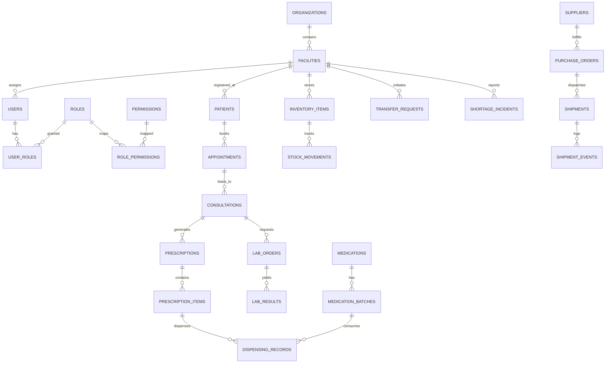

# DATABASE.md — Relational Data Architecture & Schema Specification
## Smart Health & Supply Chain Resilience Platform

> **Target Database Engine:** PostgreSQL 15+  
> **ORM Layer:** SQLAlchemy 2.0 (Asyncpg)  
> **Migration Manager:** Alembic  
> **Primary Key Strategy:** UUIDv4 (`gen_random_uuid()`)  
> **Timestamp Strategy:** `TIMESTAMPTZ` in UTC (`clock_timestamp()`)

---

### 1. Architectural Entity Groups

---

### 2. Entity Dictionary & Key Attributes

#### 2.1 Identity, RBAC & Governance
1. **`organizations`**
   - `id` (UUID, PK), `name` (VARCHAR), `code` (VARCHAR, UQ), `org_type` (ENUM: `MINISTRY`, `STATE_HEALTH_DEPT`, `DISTRICT_HEALTH_OFFICE`, `VENDOR`), `is_active` (BOOL), `created_at`, `updated_at`.
2. **`facilities`**
   - `id` (UUID, PK), `organization_id` (UUID, FK), `name` (VARCHAR), `code` (VARCHAR, UQ), `facility_type` (ENUM: `PHC`, `CHC`, `DISTRICT_HOSPITAL`, `CENTRAL_WAREHOUSE`, `DISTRICT_WAREHOUSE`), `state` (VARCHAR), `district` (VARCHAR), `latitude` (DECIMAL), `longitude` (DECIMAL), `is_active` (BOOL), `created_at`, `updated_at`.
3. **`users`**
   - `id` (UUID, PK), `organization_id` (UUID, FK), `facility_id` (UUID, FK, Nullable), `email` (VARCHAR, UQ), `hashed_password` (VARCHAR), `full_name` (VARCHAR), `phone_number` (VARCHAR, Nullable), `is_active` (BOOL), `is_verified` (BOOL), `mfa_enabled` (BOOL), `mfa_secret` (VARCHAR, Nullable), `created_at`, `updated_at`.
4. **`roles`**
   - `id` (UUID, PK), `name` (VARCHAR), `code` (VARCHAR, UQ), `description` (TEXT), `is_system` (BOOL, default true), `is_active` (BOOL), `created_at`, `updated_at`.
5. **`permissions`**
   - `id` (UUID, PK), `code` (VARCHAR, UQ), `module` (VARCHAR), `resource` (VARCHAR), `action` (VARCHAR), `description` (TEXT), `is_active` (BOOL), `created_at`, `updated_at`.
6. **`user_roles`**
   - `id` (UUID, PK), `user_id` (UUID, FK), `role_id` (UUID, FK), `organization_id` (UUID, FK, Nullable), `facility_id` (UUID, FK, Nullable), `scope_level` (ENUM: `GLOBAL`, `STATE`, `DISTRICT`, `FACILITY`, `SELF`), `granted_at`, `expires_at`.
7. **`role_permissions`**
   - `role_id` (UUID, FK), `permission_id` (UUID, FK), Primary Key (`role_id`, `permission_id`), `granted_at`.
8. **`user_sessions`**
   - `id` (UUID, PK), `user_id` (UUID, FK), `refresh_token_hash` (VARCHAR, UQ), `user_agent` (VARCHAR), `ip_address` (INET), `is_revoked` (BOOL), `expires_at`, `created_at`.
9. **`audit_logs`**
   - `id` (UUID, PK), `actor_id` (UUID, FK, Nullable), `organization_id` (UUID, FK, Nullable), `action` (VARCHAR), `resource_type` (VARCHAR), `resource_id` (VARCHAR), `old_state` (JSONB, Nullable), `new_state` (JSONB, Nullable), `ip_address` (VARCHAR), `user_agent` (VARCHAR), `created_at`.

#### 2.2 Healthcare Domain
1. **`patients`**
   - `id` (UUID, PK), `user_id` (UUID, FK, Nullable for registered portal users), `primary_facility_id` (UUID, FK), `patient_identifier` (VARCHAR, UQ), `first_name` (VARCHAR), `last_name` (VARCHAR), `date_of_birth` (DATE), `gender` (VARCHAR), `phone_number` (VARCHAR), `blood_group` (VARCHAR, Nullable), `is_active` (BOOL), `created_at`, `updated_at`.
2. **`appointments`**
   - `id` (UUID, PK), `facility_id` (UUID, FK), `patient_id` (UUID, FK), `doctor_id` (UUID, FK, Nullable), `appointment_date` (TIMESTAMPTZ), `status` (ENUM: `SCHEDULED`, `CHECKED_IN`, `IN_CONSULTATION`, `COMPLETED`, `CANCELLED`, `NO_SHOW`), `reason` (TEXT), `created_at`, `updated_at`.
3. **`consultations`**
   - `id` (UUID, PK), `appointment_id` (UUID, FK, Nullable), `patient_id` (UUID, FK), `doctor_id` (UUID, FK), `facility_id` (UUID, FK), `triage_vitals` (JSONB: bp, pulse, temp, weight, spo2), `symptoms` (TEXT), `clinical_notes` (TEXT), `status` (ENUM: `DRAFT`, `FINALIZED`), `started_at`, `completed_at`.
4. **`diagnoses`**
   - `id` (UUID, PK), `consultation_id` (UUID, FK), `icd10_code` (VARCHAR), `condition_name` (VARCHAR), `diagnosis_type` (ENUM: `PRIMARY`, `SECONDARY`, `PROVISIONAL`), `notes` (TEXT), `created_at`.
5. **`prescriptions`**
   - `id` (UUID, PK), `consultation_id` (UUID, FK), `patient_id` (UUID, FK), `doctor_id` (UUID, FK), `facility_id` (UUID, FK), `status` (ENUM: `PENDING`, `PARTIALLY_DISPENSED`, `COMPLETED`, `CANCELLED`), `notes` (TEXT), `created_at`, `updated_at`.
6. **`prescription_items`**
   - `id` (UUID, PK), `prescription_id` (UUID, FK), `medication_id` (UUID, FK), `dosage` (VARCHAR), `frequency` (VARCHAR), `duration_days` (INTEGER), `quantity_prescribed` (INTEGER), `quantity_dispensed` (INTEGER, default 0), `instructions` (TEXT), `status` (ENUM: `PENDING`, `DISPENSED`).
7. **`lab_orders`**
   - `id` (UUID, PK), `consultation_id` (UUID, FK), `patient_id` (UUID, FK), `ordered_by_doctor_id` (UUID, FK), `facility_id` (UUID, FK), `status` (ENUM: `REQUESTED`, `SAMPLE_COLLECTED`, `IN_PROGRESS`, `COMPLETED`, `CANCELLED`), `clinical_indications` (TEXT), `created_at`, `updated_at`.
8. **`lab_results`**
   - `id` (UUID, PK), `lab_order_id` (UUID, FK), `test_name` (VARCHAR), `result_value` (VARCHAR), `reference_range` (VARCHAR), `unit` (VARCHAR), `is_abnormal` (BOOL), `technician_id` (UUID, FK), `verified_by_doctor_id` (UUID, FK, Nullable), `verified_at`, `created_at`.

#### 2.3 Pharmacy & Inventory Domain
1. **`medications`**
   - `id` (UUID, PK), `code` (VARCHAR, UQ), `generic_name` (VARCHAR), `brand_name` (VARCHAR), `category` (VARCHAR), `dosage_form` (VARCHAR), `strength` (VARCHAR), `unit_of_measure` (VARCHAR), `is_essential` (BOOL), `storage_temperature_min` (DECIMAL), `storage_temperature_max` (DECIMAL), `is_active` (BOOL), `created_at`, `updated_at`.
2. **`medication_batches`**
   - `id` (UUID, PK), `medication_id` (UUID, FK), `facility_id` (UUID, FK), `batch_number` (VARCHAR), `manufacture_date` (DATE), `expiry_date` (DATE), `quantity_initial` (INTEGER), `quantity_available` (INTEGER), `unit_cost` (DECIMAL), `is_quarantined` (BOOL), `created_at`, `updated_at`.
3. **`inventory_items`**
   - `id` (UUID, PK), `facility_id` (UUID, FK), `medication_id` (UUID, FK), `total_quantity` (INTEGER), `reorder_level` (INTEGER), `critical_level` (INTEGER), `max_capacity` (INTEGER), `last_reconciled_at`, `updated_at`.
4. **`stock_movements`**
   - `id` (UUID, PK), `facility_id` (UUID, FK), `medication_id` (UUID, FK), `batch_id` (UUID, FK, Nullable), `movement_type` (ENUM: `RECEIPT`, `DISPENSED`, `TRANSFER_IN`, `TRANSFER_OUT`, `ADJUSTMENT_ADD`, `ADJUSTMENT_SUBTRACT`, `EXPIRED`, `DAMAGED`), `quantity` (INTEGER), `balance_after` (INTEGER), `reference_type` (VARCHAR: `PRESCRIPTION`, `TRANSFER`, `PO`, `ADJUSTMENT`), `reference_id` (UUID, Nullable), `notes` (TEXT), `created_by` (UUID, FK), `created_at`.
5. **`dispensing_records`**
   - `id` (UUID, PK), `prescription_item_id` (UUID, FK), `batch_id` (UUID, FK), `dispensed_by_id` (UUID, FK), `quantity_dispensed` (INTEGER), `dispensed_at`, `notes` (TEXT).

#### 2.4 Supply Chain, Logistics & Resilience Domain
1. **`suppliers`**
   - `id` (UUID, PK), `name` (VARCHAR), `code` (VARCHAR, UQ), `contact_email` (VARCHAR), `contact_phone` (VARCHAR), `license_number` (VARCHAR), `address` (TEXT), `reliability_score` (DECIMAL, default 1.0), `is_active` (BOOL), `created_at`, `updated_at`.
2. **`warehouses`**
   - `id` (UUID, PK), `facility_id` (UUID, FK), `name` (VARCHAR), `code` (VARCHAR, UQ), `storage_type` (ENUM: `AMBIENT`, `COLD_CHAIN`, `HAZARDOUS`), `total_sqft` (INTEGER), `utilized_capacity_pct` (DECIMAL), `is_active` (BOOL), `created_at`, `updated_at`.
3. **`purchase_requests`**
   - `id` (UUID, PK), `facility_id` (UUID, FK), `requested_by` (UUID, FK), `status` (ENUM: `SUBMITTED`, `DISTRICT_APPROVED`, `REJECTED`, `CONVERTED_TO_PO`), `urgency` (ENUM: `ROUTINE`, `URGENT`, `EMERGENCY`), `total_estimated_cost` (DECIMAL), `created_at`, `updated_at`.
4. **`purchase_orders`**
   - `id` (UUID, PK), `po_number` (VARCHAR, UQ), `supplier_id` (UUID, FK), `destination_facility_id` (UUID, FK), `created_by` (UUID, FK), `approved_by` (UUID, FK, Nullable), `status` (ENUM: `DRAFT`, `ISSUED`, `ACKNOWLEDGED`, `IN_TRANSIT`, `FULFILLED`, `CANCELLED`), `total_amount` (DECIMAL), `expected_delivery_date` (DATE), `created_at`, `updated_at`.
5. **`transfer_requests`**
   - `id` (UUID, PK), `source_facility_id` (UUID, FK), `destination_facility_id` (UUID, FK), `requested_by` (UUID, FK), `approved_by` (UUID, FK, Nullable), `status` (ENUM: `REQUESTED`, `APPROVED`, `DISPATCHED`, `RECEIVED`, `REJECTED`, `CANCELLED`), `urgency` (ENUM: `NORMAL`, `EMERGENCY_SHORTAGE`), `created_at`, `updated_at`.
6. **`shipments`**
   - `id` (UUID, PK), `tracking_number` (VARCHAR, UQ), `purchase_order_id` (UUID, FK, Nullable), `transfer_request_id` (UUID, FK, Nullable), `origin_facility_id` (UUID, FK, Nullable), `destination_facility_id` (UUID, FK), `status` (ENUM: `PENDING`, `DISPATCHED`, `IN_TRANSIT`, `DELAYED`, `DELIVERED`, `CANCELLED`), `carrier_name` (VARCHAR), `temperature_monitored` (BOOL), `dispatched_at`, `delivered_at`, `created_at`, `updated_at`.
7. **`shipment_events`**
   - `id` (UUID, PK), `shipment_id` (UUID, FK), `event_type` (ENUM: `DEPARTED`, `MILESTONE_CHECKPOINT`, `TEMPERATURE_EXCURSION`, `DELAY_REPORTED`, `DELIVERED`), `location_name` (VARCHAR), `latitude` (DECIMAL), `longitude` (DECIMAL), `recorded_temp` (DECIMAL, Nullable), `notes` (TEXT), `logged_by` (UUID, FK), `timestamp`.
8. **`shortage_incidents`**
   - `id` (UUID, PK), `facility_id` (UUID, FK), `medication_id` (UUID, FK), `reported_by` (UUID, FK), `severity` (ENUM: `WARNING_LOW_STOCK`, `CRITICAL_RUNOUT_IMMINENT`, `COMPLETE_STOCKOUT`), `current_stock` (INTEGER), `projected_runout_date` (DATE), `status` (ENUM: `REPORTED`, `ESCALATED_DISTRICT`, `ESCALATED_STATE`, `MITIGATED`, `RESOLVED`), `resolution_notes` (TEXT), `resolved_at`, `created_at`, `updated_at`.

#### 2.5 Intelligence & Operations
1. **`alerts`**
   - `id` (UUID, PK), `facility_id` (UUID, FK, Nullable), `alert_type` (ENUM: `LOW_STOCK`, `CRITICAL_SHORTAGE`, `BATCH_EXPIRING`, `COLD_CHAIN_BREACH`, `ABNORMAL_DEMAND`), `severity` (ENUM: `INFO`, `WARNING`, `CRITICAL`, `EMERGENCY`), `title` (VARCHAR), `message` (TEXT), `is_acknowledged` (BOOL), `acknowledged_by` (UUID, FK, Nullable), `created_at`.
2. **`system_configs`**
   - `id` (UUID, PK), `config_key` (VARCHAR, UQ), `config_value` (JSONB), `description` (TEXT), `is_secret` (BOOL, default false), `updated_by` (UUID, FK), `updated_at`.
3. **`forecast_records`**
   - `id` (UUID, PK), `facility_id` (UUID, FK), `medication_id` (UUID, FK), `forecast_date` (DATE), `forecast_horizon_days` (INTEGER), `predicted_consumption` (DECIMAL), `confidence_interval_lower` (DECIMAL), `confidence_interval_upper` (DECIMAL), `generated_at`.

---

### 3. PostgreSQL Performance & Integrity Rules

- **UUID PKs**: All tables use `UUID` generated via `gen_random_uuid()` at the database level.
- **Indexes**:
  - Foreign keys (`user_roles.user_id`, `stock_movements.facility_id`, `appointments.patient_id`, etc.) have explicit b-tree indexes.
  - Expiry and inventory lookup: Composite index `(facility_id, medication_id, expiry_date)` on `medication_batches`.
  - Date queries: B-tree indexes on `appointments.appointment_date`, `stock_movements.created_at`, and `shipments.dispatched_at`.
- **Integrity Constraints**:
  - `CHECK (quantity_available >= 0)` on `medication_batches` (never allow negative inventory).
  - `CHECK (quantity_dispensed <= quantity_prescribed)` on `prescription_items`.
  - `CHECK (reorder_level >= critical_level)` on `inventory_items`.
