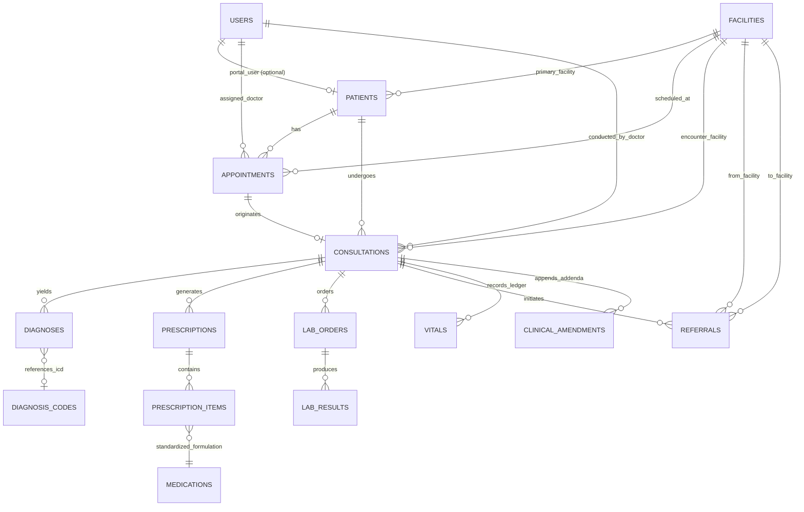

# HEALTHCARE_CORE_DESIGN.md — Phase 2 Design Specification
## Smart Health & Supply Chain Resilience Platform

> **Module:** Healthcare Core (Primary Health Care & Clinical Operations)  
> **Status:** Architecture Approved  
> **Compliance:** Zero-Hardcoding, Database-Driven RBAC, HIPAA/Digital Health Data Integrity

---

### A. Healthcare Relational ER Model



#### Entity Details & Attributes:
1. **`patients`**
   - `id`: UUID (PK, `gen_random_uuid()`)
   - `user_id`: UUID (FK `users.id`, NULLABLE, 1:1 optional for citizen portal access)
   - `primary_facility_id`: UUID (FK `facilities.id`, NOT NULL)
   - `patient_identifier`: VARCHAR(50) (UNIQUE, NOT NULL, format: `PAT-YYYYMM-XXXXX`)
   - `first_name`: VARCHAR(100) (NOT NULL)
   - `last_name`: VARCHAR(100) (NOT NULL)
   - `date_of_birth`: DATE (NOT NULL)
   - `gender`: VARCHAR(20) (NOT NULL, e.g. `MALE`, `FEMALE`, `OTHER`)
   - `phone_number`: VARCHAR(50) (NOT NULL, indexed for lookup)
   - `blood_group`: VARCHAR(10) (NULLABLE, e.g. `A+`, `O-`)
   - `address`: TEXT (NULLABLE)
   - `emergency_contact_name`: VARCHAR(100) (NULLABLE)
   - `emergency_contact_phone`: VARCHAR(50) (NULLABLE)
   - `emergency_contact_relation`: VARCHAR(50) (NULLABLE)
   - `is_active`: BOOLEAN (NOT NULL, default TRUE)
   - `created_at`, `updated_at`: TIMESTAMPTZ (NOT NULL)
   - Indexes: `ix_patients_patient_identifier`, `ix_patients_phone_number`, `ix_patients_primary_facility_id`

2. **`appointments`**
   - `id`: UUID (PK)
   - `patient_id`: UUID (FK `patients.id`, NOT NULL)
   - `facility_id`: UUID (FK `facilities.id`, NOT NULL)
   - `doctor_id`: UUID (FK `users.id`, NULLABLE)
   - `appointment_date`: TIMESTAMPTZ (NOT NULL)
   - `status`: ENUM (`SCHEDULED`, `CHECKED_IN`, `IN_CONSULTATION`, `COMPLETED`, `CANCELLED`, `NO_SHOW`)
   - `reason`: TEXT (NOT NULL)
   - `cancellation_reason`: TEXT (NULLABLE)
   - `created_at`, `updated_at`: TIMESTAMPTZ
   - Indexes: `ix_appointments_patient_id`, `ix_appointments_facility_id`, `ix_appointments_date_status`

3. **`consultations`**
   - `id`: UUID (PK)
   - `appointment_id`: UUID (FK `appointments.id`, NULLABLE)
   - `patient_id`: UUID (FK `patients.id`, NOT NULL)
   - `doctor_id`: UUID (FK `users.id`, NOT NULL)
   - `facility_id`: UUID (FK `facilities.id`, NOT NULL)
   - `status`: ENUM (`IN_PROGRESS`, `FINALIZED`, `CANCELLED`)
   - `triage_vitals`: JSONB (Intake snapshot: systolic_bp, diastolic_bp, pulse_rate, temperature_celsius, respiratory_rate, spo2_percent, weight_kg, height_cm, bmi)
   - `chief_complaint`: TEXT (NOT NULL)
   - `clinical_notes`: TEXT (NULLABLE)
   - `examination_findings`: TEXT (NULLABLE)
   - `started_at`: TIMESTAMPTZ (NOT NULL)
   - `finalized_at`: TIMESTAMPTZ (NULLABLE)
   - `created_at`, `updated_at`: TIMESTAMPTZ
   - Indexes: `ix_consultations_patient_id`, `ix_consultations_doctor_id`, `ix_consultations_facility_id`

4. **`vitals` (Phase 2.1 Hardening)**
   - `id`: UUID (PK)
   - `consultation_id`: UUID (FK `consultations.id`, NOT NULL, indexed)
   - `systolic_bp`: INTEGER (NULLABLE, range 40-300 mmHg)
   - `diastolic_bp`: INTEGER (NULLABLE, range 20-200 mmHg)
   - `pulse_rate`: INTEGER (NULLABLE, range 20-260 bpm)
   - `temperature_celsius`: NUMERIC(4, 1) (NULLABLE, range 25.0-45.0 °C)
   - `respiratory_rate`: INTEGER (NULLABLE, range 4-80 bpm)
   - `spo2_percent`: INTEGER (NULLABLE, range 50-100 %)
   - `weight_kg`: NUMERIC(5, 2) (NULLABLE, range 0.5-500.0 kg)
   - `height_cm`: NUMERIC(5, 1) (NULLABLE, range 20.0-300.0 cm)
   - `bmi`: NUMERIC(4, 1) (Computed automatically)
   - `recorded_by_id`: UUID (FK `users.id`, NOT NULL)
   - `recorded_at`: TIMESTAMPTZ (NOT NULL)
   - `created_at`: TIMESTAMPTZ (NOT NULL)

5. **`clinical_amendments` (Phase 2.1 Hardening)**
   - `id`: UUID (PK)
   - `consultation_id`: UUID (FK `consultations.id`, NOT NULL, indexed)
   - `amendment_reason`: TEXT (NOT NULL, clinical justification)
   - `amendment_notes`: TEXT (NOT NULL, additive observations)
   - `amended_by_id`: UUID (FK `users.id`, NOT NULL)
   - `created_at`: TIMESTAMPTZ (NOT NULL)

6. **`medications` (Reference Data Catalog)**
   - `id`: UUID (PK)
   - `generic_name`: VARCHAR(255) (NOT NULL, indexed)
   - `brand_name`: VARCHAR(255) (NULLABLE, indexed)
   - `strength`: VARCHAR(100) (NOT NULL, e.g. "500 mg")
   - `dosage_form`: VARCHAR(100) (NOT NULL, e.g. "TABLET", "SYRUP", "INJECTION")
   - `route`: VARCHAR(50) (NOT NULL, e.g. "ORAL", "IV", "IM")
   - `unit`: VARCHAR(50) (NOT NULL, e.g. "TABLET", "ML")
   - `is_active`: BOOLEAN (NOT NULL, default TRUE)
   - `created_at`, `updated_at`: TIMESTAMPTZ (NOT NULL)

7. **`diagnosis_codes` (ICD-10 Reference Catalog)**
   - `id`: UUID (PK)
   - `code`: VARCHAR(20) (NOT NULL, UNIQUE, indexed, e.g. "J20.9")
   - `description`: VARCHAR(500) (NOT NULL)
   - `category`: VARCHAR(100) (NOT NULL)
   - `version`: VARCHAR(20) (NOT NULL, default "ICD-10-CM")
   - `is_active`: BOOLEAN (NOT NULL, default TRUE)
   - `created_at`, `updated_at`: TIMESTAMPTZ (NOT NULL)

8. **`diagnoses`**
   - `id`: UUID (PK)
   - `consultation_id`: UUID (FK `consultations.id`, NOT NULL)
   - `patient_id`: UUID (FK `patients.id`, NOT NULL)
   - `icd10_code`: VARCHAR(20) (NOT NULL)
   - `condition_name`: VARCHAR(255) (NOT NULL)
   - `diagnosis_type`: ENUM (`PRIMARY`, `SECONDARY`, `PROVISIONAL`)
   - `notes`: TEXT (NULLABLE)
   - `created_at`: TIMESTAMPTZ

9. **`prescriptions` & `prescription_items`**
   - `prescriptions`: `id` (PK), `consultation_id` (FK), `patient_id` (FK), `doctor_id` (FK), `facility_id` (FK), `status` (ENUM: `DRAFT`, `ISSUED`, `PARTIALLY_DISPENSED`, `COMPLETED`, `CANCELLED`), `notes`, `created_at`, `updated_at`
   - `prescription_items`: `id` (PK), `prescription_id` (FK), `medication_name`, `medication_code`, `medication_id` (FK `medications.id`, NULLABLE), `dosage`, `frequency`, `duration_days`, `quantity_prescribed`, `quantity_dispensed` (default 0), `instructions`, `status` (ENUM: `PENDING`, `DISPENSED`, `CANCELLED`)

10. **`lab_orders` & `lab_results`**
   - `lab_orders`: `id` (PK), `consultation_id` (FK), `patient_id` (FK), `ordered_by_doctor_id` (FK), `facility_id` (FK), `test_category`, `clinical_notes`, `status` (ENUM: `ORDERED`, `SAMPLE_COLLECTED`, `IN_ANALYSIS`, `COMPLETED`, `CANCELLED`), `ordered_at`, `completed_at`, timestamps
   - `lab_results`: `id` (PK), `lab_order_id` (FK), `test_name`, `result_value`, `reference_range`, `unit`, `is_abnormal`, `performed_by_id` (FK), `verified_by_id` (FK NULLABLE), `notes`, `verified_at`, timestamps

11. **`referrals`**
   - `id`: UUID (PK), `consultation_id` (FK), `patient_id` (FK), `from_facility_id` (FK), `to_facility_id` (FK NULLABLE), `to_facility_name` (VARCHAR), `referral_reason` (TEXT), `urgency` (ENUM: `ROUTINE`, `URGENT`, `EMERGENCY`), `clinical_summary` (TEXT), `status` (ENUM: `PENDING`, `ACCEPTED`, `COMPLETED`, `REJECTED`), `referred_by_doctor_id` (FK), timestamps

---

### B. End-to-End Healthcare Workflow

```
1. PATIENT REGISTRATION
   Nurse or Staff registers citizen at PHC -> Unique Patient Identifier generated (PAT-YYYYMM-XXXXX).
       ↓
2. APPOINTMENT SCHEDULING
   Patient / Nurse books appointment for clinical consultation -> Status: SCHEDULED.
       ↓
3. CLINICAL TRIAGE & CHECK-IN
   Patient arrives at PHC -> Nurse records triage vitals (Blood pressure, Pulse, Temperature, SpO2, Weight) -> Status: CHECKED_IN.
       ↓
4. CONSULTATION (DOCTOR ENCOUNTER)
   Doctor commences encounter -> Consultation Status: IN_PROGRESS.
   Doctor reviews history, symptoms, triage vitals, and records clinical examination findings.
       ↓
5. CLINICAL DIAGNOSIS & ORDERS
   Doctor assigns ICD-10 diagnosis -> Generates Prescription items and/or orders diagnostic Lab panel.
       ↓
6. REFERRAL (IF SPECIALIZED CARE REQUIRED)
   If patient requires tertiary care/specialist -> Doctor creates Referral to District Hospital/Medical College.
       ↓
7. ENCOUNTER FINALIZATION
   Doctor locks consultation -> Status: FINALIZED (Immutable clinical record).
       ↓
8. DISPENSING / LAB FULFILLMENT
   - Pharmacist receives prescription -> Dispenses items with batch verification.
   - Lab Tech collects sample -> Analyzes sample -> Enters results -> Doctor verifies results.
```

---

### C. State Machines & Transition Invariants

#### 1. Appointment State Transitions
```
SCHEDULED ────▶ CHECKED_IN ────▶ IN_CONSULTATION ────▶ COMPLETED
    │                 │
    ├──▶ CANCELLED    └──▶ NO_SHOW
    └──▶ NO_SHOW
```
*Rule*: Once `COMPLETED` or `CANCELLED`, appointment cannot transition to any other status.

#### 2. Consultation State Transitions
```
IN_PROGRESS ────▶ FINALIZED
     │
     └──▶ CANCELLED
```
*Rule*: Once `FINALIZED`, clinical notes, triage vitals, and diagnoses cannot be mutated.

#### 3. Prescription State Transitions
```
DRAFT ────▶ ISSUED ────▶ PARTIALLY_DISPENSED ────▶ COMPLETED
              │
              └──▶ CANCELLED
```

#### 4. Lab Order State Transitions
```
ORDERED ────▶ SAMPLE_COLLECTED ────▶ IN_ANALYSIS ────▶ COMPLETED
    │
    └──▶ CANCELLED
```

---

### D. Role × Permission × Scope Matrix for Healthcare APIs

| Action / Endpoint | Permission Code | Scope Check | Authorized Roles |
| :--- | :--- | :--- | :--- |
| Create Patient | `patients.profile.create` | Facility | Nurse, Doctor, PHC Admin |
| Read Patient Profile | `patients.profile.read` | Facility / Self | Doctor, Nurse, PHC Admin, Patient (Self) |
| Read Medical Records | `patients.records.read` | Facility / Self | Doctor, Nurse, Patient (Self) |
| Book Appointment | `appointments.manage` | Facility / Self | Nurse, PHC Admin, Patient (Self) |
| Check-in / Vitals | `patients.vitals.record` | Facility | Nurse, Doctor |
| Start/Finalize Consultation | `consultations.conduct` | Facility | Doctor |
| Add Diagnoses | `consultations.conduct` | Facility | Doctor |
| Create Prescription | `prescriptions.create` | Facility | Doctor |
| Dispense Prescription | `prescriptions.dispense`| Facility | Pharmacist |
| Create Lab Order | `labs.order.create` | Facility | Doctor |
| Record Lab Results | `labs.result.record` | Facility | Lab Technician |
| Verify Lab Results | `labs.result.verify` | Facility | Doctor, Lab Director |
| Create Referral | `referrals.create` | Facility | Doctor |
